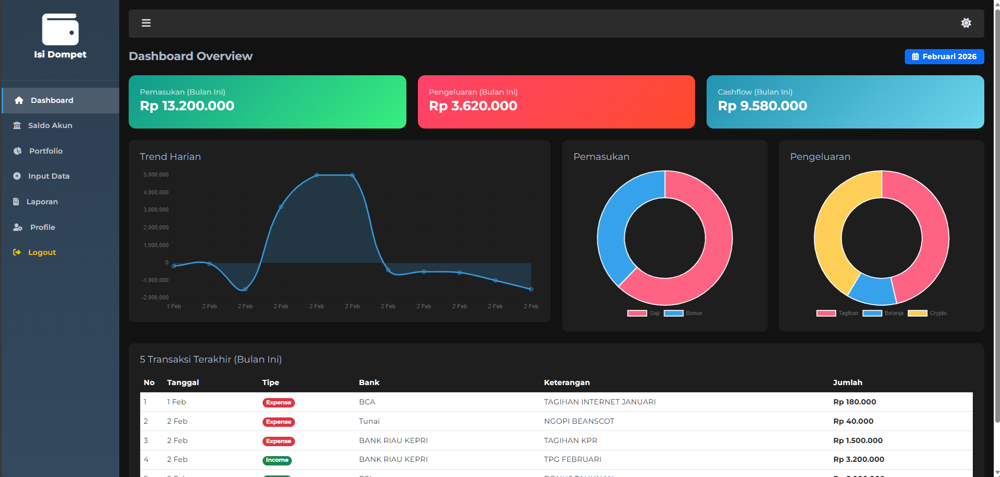
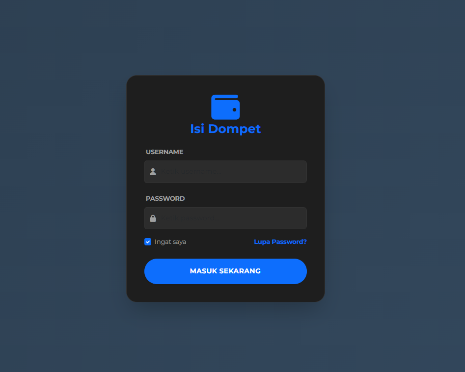
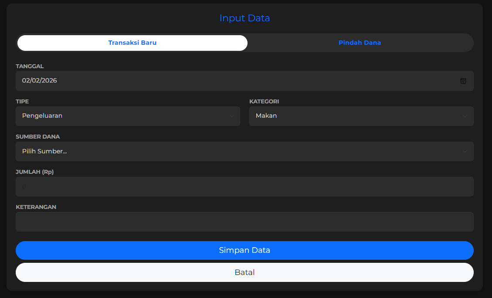
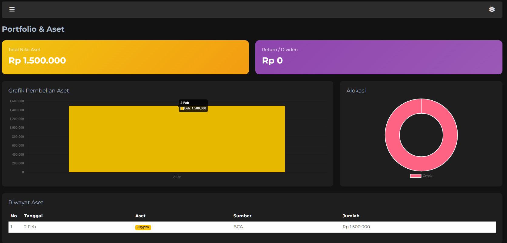

# 💰 Isi Dompet - Google Apps Script Finance Tracker

**Isi Dompet** adalah aplikasi web manajemen keuangan pribadi (Personal Finance Tracker) berbasis **Google Sheets** dan **Google Apps Script**. Aplikasi ini dirancang untuk mencatat pemasukan, pengeluaran, transfer antar akun, serta memantau portofolio investasi (Saham, Crypto, Emas) secara *real-time* dengan antarmuka yang modern, responsif, dan ringan.



## ✨ Fitur Utama

* **🔐 Secure Login:** Sistem login sederhana menggunakan database Google Sheet.
* **📊 Dashboard Interaktif:** Visualisasi Cashflow (Pemasukan vs Pengeluaran) menggunakan Chart.js.
* **💸 Manajemen Transaksi:** Input pemasukan, pengeluaran, dan **Transfer Antar Akun** (Pindah Dana) dengan mudah.
* **🏦 Multi-Account Support:** Mendukung berbagai sumber dana (Bank, E-Wallet, Tunai).
* **📈 Portfolio Tracker:** Deteksi otomatis kategori investasi (Saham, Crypto, Reksadana, Emas) dan hitung return aset.
* **⚡ Real-time & Silent Update:** Saldo terupdate otomatis tanpa *reload* halaman yang mengganggu (Silent Refresh).
* **📱 Responsif & Dark Mode:** Tampilan optimal di Mobile & Desktop, dilengkapi fitur Dark Mode.
* **🛡️ Validasi Saldo:** Mencegah pengeluaran jika saldo akun tidak mencukupi.

## 📸 Screenshots

Berikut adalah tampilan antarmuka aplikasi:

| **Halaman Login** | **Dashboard Utama** |
|:---:|:---:|
|  |  |
| *Tampilan Login yang bersih* | *Ringkasan Keuangan & Grafik* |

| **Input Transaksi & Transfer** | **Manajemen Aset** |
|:---:|:---:|
|  |  |
| *Form Input dengan Validasi Saldo* | *Monitoring Portfolio Investasi* |


## 🛠️ Teknologi yang Digunakan

* **Backend:** Google Apps Script (GAS)
* **Database:** Google Sheets
* **Frontend:** HTML5, CSS3, JavaScript
* **Frameworks & Libraries:**
    * Bootstrap 5 (UI Layout)
    * Chart.js (Visualisasi Data)
    * SweetAlert2 (Notifikasi & Popup Cantik)
    * FontAwesome (Ikon)

## 🚀 Cara Instalasi & Penggunaan

### 1. Persiapan Google Sheet
Buat Spreadsheet baru di Google Drive, lalu buat Tab (Sheet) dengan nama berikut:
* **`Transactions`**: Kolom (Date, Type, Category, Amount, Description, Source)
* **`Bank`**: Kolom (Nama Bank, Saldo)
* **`ewallet`**: Kolom (Nama E-Wallet, Saldo)
* **`Tunai`**: Kolom (Nama, Saldo)
* **`user`**: Kolom (Username, Password)

### 2. Setup Project (Via CLASP)
Pastikan Anda sudah menginstall Node.js dan CLASP.

```bash
# Clone repository ini
git clone  https://github.com/benialandra/appscript_money_tracker.git

# Masuk ke folder
cd appscript_money_tracker

# Login ke Google Apps Script
clasp login

# Buat project baru (jika belum ada) atau Clone project yang sudah ada
clasp create --title "Isi Dompet" --type webapp
# ATAU
clasp clone "SCRIPT_ID_GOOGLE_ANDA"

# Push kode ke Google Server
clasp push


3. Deploy
    a. Buka Script Editor di browser via clasp open.
    b. Klik Deploy > New Deployment.
    c. Pilih type Web App.
    d. Execute as: Me.
    e. Who has access: Anyone (atau Only Myself).
    f. Klik Deploy dan buka URL yang diberikan.


📂 Struktur Folder
    Code.js - Logic Backend (Server-side Google Script).
    Index.html - Halaman utama (Container).
    ViewApp.html - Komponen tampilan aplikasi (Dashboard, Input, dll).
    ViewLogin.html - Komponen tampilan login.
    Styles.html - CSS & Styling (Custom CSS + Bootstrap Override).
    JavaScript.html - Logic Frontend (Fetch data, DOM Manipulation, Chart.js).

👤 Author
    Beni Alandra
    Data Analyst | IT Support | Database Administrator
    Location: Batam, Indonesia